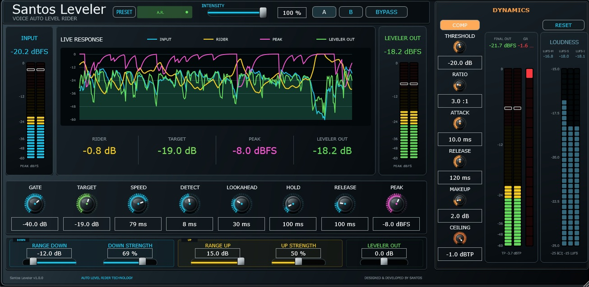

# Santos Leveler v1.0.0

**Voice Auto Level Rider · VST3 · Windows x64 · Open Source**

[](https://github.com/santosmanilva/SANTOS-LEVELER/actions/workflows/build-windows-vst3.yml)


[English documentation](README_EN.md)



Santos Leveler es un procesador VST3 para voz diseñado para mantener un nivel más uniforme de forma automática, conservando naturalidad y ofreciendo control visual detallado del proceso. Está desarrollado en C++ con JUCE.

**Diseñado y desarrollado por Santos Leveler Project.**

> Santos Leveler es **software libre y de código abierto** bajo **GNU Affero General Public License v3.0 (AGPL-3.0-only)**. Puedes usar, estudiar, modificar y redistribuir el código conforme a los términos de AGPLv3. Consulta [LICENSE](LICENSE).

## Historia del proyecto

Los primeros prototipos de Santos Leveler se crearon en **[MNodes](https://marionietoworld.com/mnodes/)**, el entorno modular de audio desarrollado por **Mario Nieto**. MNodes permitió explorar y validar inicialmente la idea del nivelador automático de voz antes de reimplementar el proyecto como plugin VST3 nativo en C++/JUCE.

El archivo `historical MNodes prototype` se conserva únicamente como referencia histórica de esa etapa. La versión actual no depende de MNodes en tiempo de ejecución.

Más información: [HISTORY.md](HISTORY.md).

## Compatibilidad

- Windows 10/11 x64
- VST3 de 64 bits
- Efecto de audio para pistas mono y estéreo
- Procesamiento estéreo enlazado
- Interfaz redimensionable
- Tamaño inicial: **1310 × 640**
- Tamaño máximo: **2625 × 1280**
- Sin versión Standalone

## Características principales

- **Voice Auto Level Rider** con Target, Gate, Speed, Detect, Lookahead, Hold y Release.
- Detector combinado **FAST/SLOW**.
- **Smart Gate** con histéresis.
- **Preserve Dynamics**.
- **Range Down / Range Up** hasta ±16 dB.
- **Down Strength / Up Strength**.
- **Intensity** global para Rider y Peak 2.
- **Peak 2** con release adaptativo.
- Módulo **Dynamics** con compresor de voz feed-forward, estéreo enlazado y soft knee.
- **True Peak Limiter** con Ceiling ajustable de -9 a -1 dBTP.
- Medidores de pico para Input, Leveler Out y Final Out.
- Medición **True Peak dBTP** y **LUFS-M / LUFS-S / LUFS-I**.
- Gráfica **Live Response** con INPUT, RIDER, PEAK y LEVELER OUT activables individualmente.
- Memorias **A/B**.
- Presets de fábrica y presets de usuario `.slpreset`.
- **Bypass alineado en latencia**.

## Cadena de señal

```text
INPUT
  ↓
Voice Auto Level Rider
  ├─ FAST/SLOW detector
  ├─ Smart Gate
  ├─ Preserve Dynamics
  ├─ Range / Strength / Intensity
  └─ Peak 2
  ↓
LEVELER OUT trim
  ↓
Voice Compressor
  ↓
True Peak Limiter
  ↓
Bypass alineado
  ↓
Peak / True Peak / LUFS
  ↓
OUTPUT
```

## Parámetros Default v1.0.0

| Parámetro | Default |
|---|---:|
| Gate | -40 dB |
| Target | -19 dB |
| Speed | 79 ms |
| Detect | 8 ms |
| Lookahead | 30 ms |
| Hold | 100 ms |
| Release | 100 ms |
| Peak | -8 dBFS |
| Range Down | -12 dB |
| Down Strength | 69 % |
| Range Up | +15 dB |
| Up Strength | 50 % |
| Leveler Out | 0 dB |
| Intensity | 100 % |
| Compressor | On |
| Comp Threshold | -20 dB |
| Comp Ratio | 3:1 |
| Comp Attack | 10 ms |
| Comp Release | 120 ms |
| Comp Makeup | +2 dB |
| Ceiling | -1 dBTP |
| Bypass | Off |

## Presets

Presets de fábrica: **Default, Gentle, Natural, Broadcast y Tight**.

Los presets de usuario utilizan extensión `.slpreset` y se guardan por defecto en:

```text
Documentos\Santos Leveler Presets
```

## Medición

- **INPUT:** pico dBFS
- **LEVELER OUT:** pico dBFS antes de Dynamics
- **FINAL OUT:** pico dBFS después de compresor, True Peak y bypass final
- **TRUE PEAK:** dBTP
- **LOUDNESS:** LUFS-M, LUFS-S y LUFS-I

La medición de loudness se basa en algoritmos de **ITU-R BS.1770-5** y conceptos de EBU R128/Tech 3341. Santos Leveler no se presenta como equipo de medida certificado.

## Compilar en Windows

Requisitos:

1. Visual Studio 2022 con **Desarrollo para el escritorio con C++**.
2. CMake 3.22 o superior.
3. Git for Windows.

El proyecto usa C++17 y obtiene **JUCE 8.0.12** mediante CMake FetchContent.

```powershell
powershell -ExecutionPolicy Bypass -File .\build-windows.ps1
```

El script compila `SantosLeveler_VST3` y `SantosLevelerDSPTests`, ejecuta los tests DSP y muestra la ubicación del VST3 generado.

## Instalación

Copiar la carpeta completa `Santos Leveler.vst3` a:

```text
C:\Program Files\Common Files\VST3
```

Después, realizar un rescan de plugins VST3 en el DAW.

## Licencia

Santos Leveler se publica bajo **GNU Affero General Public License v3.0, exclusivamente versión 3 (`AGPL-3.0-only`)**.

La licencia permite usar, estudiar, modificar y redistribuir el software bajo sus condiciones de copyleft. Las redistribuciones y versiones modificadas deben cumplir las obligaciones de AGPLv3, incluido el acceso al código fuente correspondiente cuando sea exigible.

Texto oficial: https://www.gnu.org/licenses/agpl-3.0.html

Consulte también:

- [LICENSE](LICENSE)
- [PUBLIC_SOURCE_NOTICE.md](PUBLIC_SOURCE_NOTICE.md)
- [THIRD_PARTY.md](THIRD_PARTY.md)

## Aviso técnico y responsabilidad

El software se proporciona sin garantía en los términos establecidos por AGPLv3. Las funciones de loudness, pico y True Peak forman parte del flujo de procesamiento y no convierten Santos Leveler en equipo de medición certificado ni garantizan el cumplimiento de una especificación de emisión o entrega concreta.

Las versiones modificadas deben identificarse claramente como tales y no deben presentarse como versiones oficiales o respaldadas por Santos Leveler sin autorización.

## Contacto

**Santos Leveler Project**  
GitHub: `github.com/santosmanilva/Santos-Leveler`
